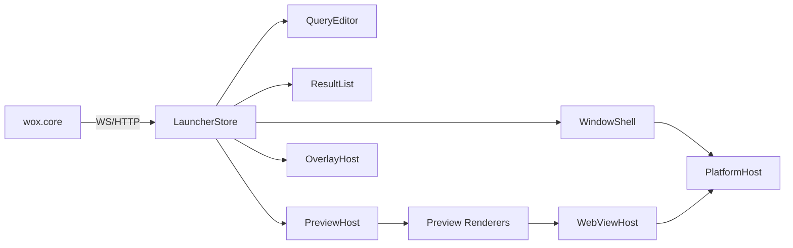

# Launcher Runtime Design

## Problem
Wox currently ships the launcher window on top of Flutter while `wox.core` already owns most query, result, preview, and window-control behavior through HTTP and WebSocket APIs. This split works, but the launcher path now carries runtime concerns that are more specialized than a general desktop UI:

- high-frequency query updates and incremental result flushes
- strict keyboard-first focus rules
- window show/hide and positioning behavior tied to platform shell APIs
- preview rendering for multiple content types
- embedded WebView preview with session reuse, navigation controls, and escape fallback

For the launcher window, this is closer to a dedicated runtime than a general-purpose UI surface.

## Scope
This document covers a **new launcher-only runtime** that replaces the Flutter launcher window while keeping the existing Flutter settings window.

In scope:
- query box, result list, preview pane, and launcher overlays
- existing preview protocol compatibility
- native WebView embedding on Windows, macOS, and Linux
- launcher state machine, focus rules, and migration strategy

Out of scope:
- settings window replacement
- plugin protocol redesign
- theme-store or settings-page UI reimplementation
- building a generic cross-platform GUI toolkit

## Goals
- Keep `wox.core` and plugin behavior stable by preserving the current launcher-facing protocol.
- Build a runtime specialized for Wox launcher semantics instead of a generic widget framework.
- Support the existing preview model, including `webview`, `terminal`, and remote preview loading.
- Support native embedded webviews on:
  - Windows via `WebView2`
  - macOS via `WKWebView`
  - Linux via `WebKitGTK`
- Preserve keyboard-first behavior and window-management behavior across platforms.

## Non-Goals
- No attempt to create a `fyne`-like general GUI abstraction for arbitrary applications.
- No attempt to unify launcher UI and settings UI into one rendering stack in v1.
- No plugin-defined custom preview views.

## Constraints And Existing Facts
- `wox.core` already defines a launcher preview protocol with multiple preview types, not just text and markdown.
- Preview payloads can be replaced with `remote` references when the inline payload is too large.
- The current Flutter launcher already treats `webview` preview as a specialized runtime concern with session handling and toolbar actions.
- Windows already has a concrete cached WebView session model.
- macOS currently exposes command hooks for WebView actions but does not yet provide the same session model.
- Linux currently has no equivalent embedded WebView implementation in the Flutter launcher path.

Relevant current code:
- preview protocol: `wox.core/plugin/preview.go`
- launcher preview rendering: `wox.ui.flutter/wox/lib/components/wox_preview_view.dart`
- current WebView platform bridge: `wox.ui.flutter/wox/lib/utils/webview/wox_webview_util.dart`
- Windows WebView session model: `wox.ui.flutter/wox/lib/utils/webview/windows/wox_windows_webview_platform.dart`

## Why Not Build A Smaller Fyne
`fyne` is a cross-platform GUI toolkit with general abstractions for windows, canvas objects, widgets, layout, and rendering drivers. That is the right shape for a reusable GUI framework.

Wox launcher does not need that shape.

What Wox needs is:
- one fixed window layout
- one fixed interaction model
- one fixed result protocol
- one fixed preview runtime with a few specialized renderers

If we generalize too early, the project will drift toward maintaining a second general UI framework. That increases scope without helping the launcher problem.

The recommended direction is therefore a **Wox Launcher Runtime**, not a general toolkit.

## Proposed Architecture
The new runtime keeps `wox.core` as the backend authority and replaces only the launcher rendering and platform integration layer.

### Top-Level Split
- `wox.core`
  - owns query lifecycle, plugins, result generation, preview payloads, settings, and launcher commands
- `launcher runtime`
  - owns rendering, focus, input routing, preview renderer lifecycle, native window behavior, and native webview embedding
- `Flutter settings`
  - remains unchanged in v1

### Runtime Modules
- `LauncherStore`
  - single source of truth for launcher state
- `WindowShell`
  - owns top-level window creation, visibility transitions, size, positioning, transparency, and platform shell integration
- `QueryEditor`
  - owns text input, IME integration, caret and selection behavior
- `ResultList`
  - owns result virtualization, selection, incremental reconciliation, and keyboard navigation
- `PreviewHost`
  - resolves and mounts preview renderers
- `OverlayHost`
  - owns action panel, form overlay, and fullscreen preview overlay behavior
- `PlatformHost`
  - exposes platform-specific services for focus, clipboard, theme changes, system appearance, and launcher window hooks
- `WebViewHost`
  - owns native webview sessions, active webview routing, navigation state, and platform webview backends

### Architecture Diagram

## Protocol Compatibility
The runtime should remain protocol-compatible with the existing launcher path.

### Protocol Rules
- Reuse the existing query, action, and preview endpoints.
- Reuse the existing preview type model, including:
  - `markdown`
  - `text`
  - `image`
  - `url`
  - `file`
  - `remote`
  - `terminal`
  - `webview`
  - internal structured preview types such as `plugin_detail`, `chat`, and `update`
- Reuse remote preview fetching semantics instead of introducing a second large-payload transport.

### Compatibility Principle
The launcher runtime should behave as a new UI client of `wox.core`, not as a redesign of `wox.core`.

That keeps plugin behavior stable and limits the migration surface.

## Preview Runtime
Preview handling should be moved out of the root view and treated as its own runtime subsystem.

### PreviewResolver
`PreviewResolver` transforms `WoxPreview` into a resolved runtime model.

Responsibilities:
- unwrap `remote` preview payloads
- cancel stale preview requests when selection changes
- normalize preview types into renderer-ready data
- produce loading and error states

### Resolved Preview Model
Do not pass raw preview strings directly into the final renderer path. Normalize them into typed runtime models:

- `TextPreview`
- `MarkdownPreview`
- `ImagePreview`
- `FilePreview`
- `TerminalPreview`
- `WebViewPreview`
- `CardPreview`

`CardPreview` is intentionally reserved for structured internal preview types such as:
- `plugin_detail`
- `update`
- `chat`

Normalization rules:
- `url` resolves to `WebViewPreview` with default navigation policy and no injected CSS.
- `webview` resolves to `WebViewPreview` with the explicit embedded-webview payload from `WoxPreviewWebviewData`.
- `remote` resolves first, then re-enters the same normalization path as the fetched payload.

### PreviewRenderer Contract
Each renderer implements a lifecycle contract rather than only `render()`:

- `mount(host)`
- `update(preview)`
- `focus()`
- `blur()`
- `handleKey(event)`
- `supportsFullscreen()`
- `wantsExclusivePointer()`
- `unmount()`

This keeps preview-specific behavior out of the launcher root state machine.

### Renderer Set
The runtime should ship a fixed renderer set:

- `DocumentRenderer`
  - handles `text` and `markdown`
- `FileRenderer`
  - dispatches by file type to markdown, image, PDF, code, or plain text sub-renderers
- `TerminalRenderer`
  - handles terminal preview and custom scroll behavior
- `WebViewRenderer`
  - handles native webview session attach and toolbar integration
- `CardRenderer`
  - handles `plugin_detail`, `update`, and `chat`

## WebView Design
WebView support is the highest-complexity part of the launcher runtime and must be a first-class subsystem.

### Platform Backends
- Windows: `WebView2`
- macOS: `WKWebView`
- Linux: `WebKitGTK`

Linux support assumes the system dependency on `WebKitGTK` is acceptable.

### Session Model
WebView should use explicit sessions rather than stateless view recreation.

Each `WebViewSession` owns:
- navigation state
- runtime-specific controller or native view handle
- cache identity
- injected CSS state
- JS bridge registration
- escape fallback bridge

### Session Lifecycle
- `Acquire(preview)`
  - create or reuse a session based on cache policy and cache key
- `Attach(session, hostRect)`
  - bind the session to the visible preview pane
- `Activate(session)`
  - make the session the active target for toolbar and key routing
- `Detach(session)`
  - remove the session from the current pane without destroying cached state
- `Release(session)`
  - destroy transient sessions or evicted cached sessions

### Session Cache Rules
- Cache key should be derived from URL, injected CSS, and cache policy.
- `cacheDisabled=true` always produces a transient session.
- Cached sessions survive launcher hide/show unless memory pressure or explicit eviction requires cleanup.

### WebView Interaction Rules
V1 must support:
- embedded display
- refresh
- go back
- go forward
- open inspector where supported
- active-session routing
- escape fallback to launcher
- focus switching between webview and launcher controls

### Escape And Focus Chain
Keyboard routing for `Esc` should be:

1. overlay
2. active webview
3. active preview renderer
4. launcher fallback

Launcher fallback behavior:
- if the query box is visible and should regain focus, focus query
- otherwise hide the launcher

### Design Principle
The runtime must never attempt to redraw webpage content into a generic canvas renderer. Native webviews remain native child hosts.

## Launcher State Machine
Launcher behavior should be implemented as a strict state machine instead of view-local booleans.

### Core State Groups
- `visibility`
  - `hidden`
  - `showing`
  - `visible`
  - `hiding`
- `mode`
  - `normal`
  - `preview_fullscreen`
  - `action_panel`
  - `form_overlay`
- `focusTarget`
  - `query`
  - `result_list`
  - `preview`
  - `overlay`
- `querySession`
  - `queryId`
  - `revision`
  - `isFinal`
  - `selectedResultId`
- `previewSession`
  - `token`
  - `phase`
  - `rendererId`
  - `attachedWebViewSessionId`

`previewSession.phase` values:
- `idle`
- `loading`
- `ready`
- `error`

### Required State Invariants
- Query updates and preview updates must be versioned independently.
- Preview resolution must only commit if the preview token still matches the selected result.
- A result-list selection change must immediately invalidate stale preview work.
- WebView attach and detach must track the same preview token as the selected result.

### State Transitions
- `ShowApp`
  - enter `visible + normal + focus=query`
- `HideApp`
  - blur or detach renderers, hide the window, preserve cached resources
- `QueryChanged`
  - create a new query revision, invalidate preview work, keep list reconciliation separate
- `ResultsFlushed`
  - reconcile result items, preserve selection if identity still exists
- `SelectionChanged`
  - create a new preview token and trigger preview resolution
- `PreviewResolved`
  - mount only if the token still matches the current selection
- `OpenActionPanel`
  - enter overlay mode without losing current selection
- `OpenFormOverlay`
  - freeze background preview updates while overlay is active

## Input Routing
Launcher input must be centrally routed.

### Event Priority
Events should be offered in this order:

1. overlay
2. active webview
3. active preview renderer
4. result list
5. query editor
6. window-level command handler

### Keyboard Rules
- `Esc`
  - overlay close, then webview fallback, then preview fallback, then query focus, then launcher hide
- `Enter`
  - execute current result default action
- `Alt+J`
  - toggle action panel while preserving selection
- `Tab` and `Shift+Tab`
  - cycle focus between query, results, preview, and overlay
- arrow keys
  - drive result selection by default
- text input
  - should flow back to query editor unless the current preview has exclusive input focus

### IME Requirement
IME behavior must be owned by `QueryEditor` and not depend on incidental platform widget focus behavior.

## Result List And Preview Coordination
Result list and preview need explicit coordination rules to avoid stale or flickering content.

### Identity Rules
Preview identity should be:
- `queryId`
- `resultId`
- `previewType`
- `previewDataHash`

Only identity changes should trigger renderer replacement.

### Coordination Rules
- Selection change should not recreate the whole list.
- Preview should scroll inside its own pane and should not drive launcher window height.
- Launcher auto-resize should depend on query box, toolbar, and result-count rules, not preview content.
- Remote preview and webview preview both require cancellation-safe async resolution.
- Overlay open should freeze preview churn underneath it.

## Theming
The runtime should reuse existing launcher theme semantics rather than invent a second theme model.

V1 should support:
- foreground and background colors
- result selection styling
- preview text and divider colors
- toolbar and overlay colors
- light and dark appearance changes

Theme input should still come from `wox.core`.

## Migration Strategy
Migration should be incremental and protocol-compatible.

### Phase 1: Freeze Launcher Contract
- treat the new runtime as another `wox.core` UI client
- do not redesign plugin contracts
- do not redesign preview transport

### Phase 2: Build The Minimum Shell
Implement:
- `WindowShell`
- `QueryEditor`
- `ResultList`
- `PreviewHost`

Preview support in this phase:
- `text`
- `markdown`
- `image`
- `file`

Success criteria:
- show and hide are stable
- incremental result flush is stable
- selection and preview invalidation are stable

### Phase 3: Add WebViewHost
Implement platform webview backends with one shared session abstraction.

Recommended implementation order:
1. Windows
2. macOS
3. Linux

This order matches current implementation maturity.

### Phase 4: Add Structured Preview Types
Implement:
- `terminal`
- `plugin_detail`
- `update`
- `chat`

### Phase 5: Ship Dual Frontends
- launcher uses the new runtime
- settings continue using Flutter
- keep a fallback or feature flag during rollout

## Proof Of Concept Scope
The first proof of concept should validate behavior, not polish.

### PoC Features
- show and hide the launcher window
- query input and incremental result updates
- result selection changes
- preview resolution and cancellation
- native embedded webview
- session cache and attach or detach behavior
- escape fallback from webview to launcher

### PoC Success Criteria
- repeated query updates do not flicker or desynchronize selection
- preview does not show stale content after fast selection changes
- cached webview sessions survive hide and show cycles
- `Esc`, `Tab`, arrows, and `Enter` behave consistently

## Validation Plan
### Manual Validation
- repeated fast typing
- repeated result-count growth and shrink cycles
- switching across many preview-bearing results
- opening and closing action panel and form overlay
- hiding and reopening the launcher while a cached webview preview is selected
- switching between query focus and webview focus repeatedly

### Platform Validation
- Windows with and without `WebView2` runtime available
- macOS with `WKWebView`
- Linux distributions with required `WebKitGTK` runtime available

### Stress Validation
- at least 100 consecutive selection changes across mixed preview types
- at least 50 hide and show cycles with a cached webview preview
- at least 20 rapid query revisions while results flush incrementally

## Risks
- Native webview embedding may introduce z-order, clipping, or resize edge cases.
- IME behavior may regress if focus routing is not owned centrally.
- Linux support will carry ongoing runtime dependency support costs because `WebKitGTK` is external.
- The runtime can accidentally grow into a general toolkit if renderer boundaries are not kept strict.
- Dual frontend maintenance adds short-term operational cost.

## Recommended Direction
Build a **Wox Launcher Runtime** with these boundaries:

- launcher-only
- protocol-compatible with `wox.core`
- fixed semantic components instead of generic widgets
- native webview backends per platform
- Flutter retained for settings only

This gives Wox a runtime specialized for its launcher behavior without expanding scope into a second general GUI framework.

## Follow-Up Work
After this design is approved, the next document should be an implementation plan covering:
- repository layout for the new runtime
- platform abstraction boundaries
- milestone breakdown
- smoke-test strategy
